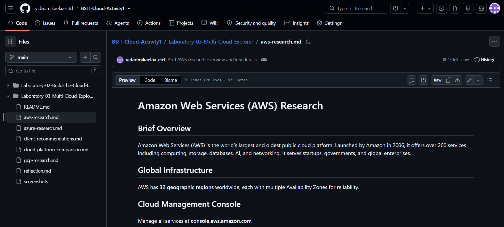

# Amazon Web Services (AWS) Research

## Brief Overview

Amazon Web Services (AWS) is Amazon's cloud computing platform, launched in 2006. It provides more than 200 cloud services including computing, storage, networking, databases, analytics, artificial intelligence (AI), and security. AWS follows a pay-as-you-go pricing model, allowing businesses to pay only for the resources they use.

---

## Global Infrastructure

AWS has one of the world's largest cloud infrastructures. It consists of:

- Regions
- Availability Zones (AZs)
- Edge Locations

This global network helps provide high availability, fault tolerance, and low latency for users worldwide.

---

## Cloud Management Console

The AWS Management Console is a web-based interface that allows users to create, configure, monitor, and manage AWS resources.

Official Website:
https://aws.amazon.com/console/

---

## Four (4) Core Services

### 1. Amazon EC2 (Elastic Compute Cloud)
Provides scalable virtual servers for hosting applications.

### 2. Amazon S3 (Simple Storage Service)
Offers secure, durable, and scalable object storage.

### 3. Amazon RDS (Relational Database Service)
Provides managed relational databases such as MySQL, PostgreSQL, MariaDB, SQL Server, and Oracle.

### 4. Amazon VPC (Virtual Private Cloud)
Allows users to create isolated virtual networks within AWS.

---

## Three (3) Advantages

- Wide variety of cloud services.
- Highly scalable and reliable infrastructure.
- Strong global presence with many Regions and Availability Zones.

---

## Typical Enterprise Use Cases

- Website hosting
- Mobile and web application deployment
- Backup and disaster recovery
- Data analytics
- Artificial Intelligence and Machine Learning

---

## Screenshot

Insert a screenshot of the AWS homepage or AWS Management Console here.

Example:

---

## References

- https://aws.amazon.com/
- https://docs.aws.amazon.com/
