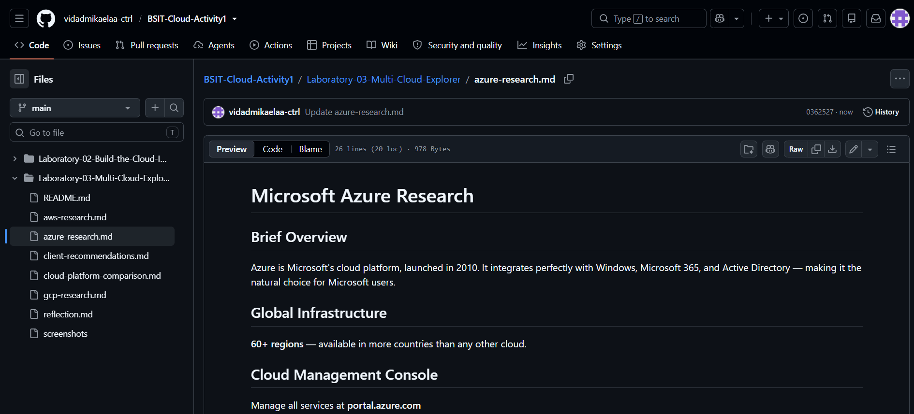

# Microsoft Azure Research

## Brief Overview

Microsoft Azure is Microsoft's cloud computing platform, launched in 2010. It offers a wide range of cloud services including virtual machines, storage, networking, databases, artificial intelligence (AI), and analytics. Azure is well known for its seamless integration with Microsoft products such as Windows Server, Microsoft 365, and Active Directory.

---

## Global Infrastructure

Microsoft Azure operates a global network of data centers across many regions worldwide. Its infrastructure includes:

- Azure Regions
- Availability Zones
- Edge Locations

This infrastructure provides high availability, disaster recovery, and low-latency access to cloud services.

---

## Cloud Management Console

The Azure Portal is a web-based interface used to create, configure, monitor, and manage Azure resources.

Official Website:
https://portal.azure.com/

---

## Four (4) Core Services

### 1. Azure Virtual Machines
Provides scalable virtual servers for hosting applications and workloads.

### 2. Azure Blob Storage
Offers secure and scalable object storage for files, images, videos, and backups.

### 3. Azure SQL Database
Provides a fully managed relational database service.

### 4. Azure Virtual Network (VNet)
Enables secure networking between Azure resources and on-premises environments.

---

## Three (3) Advantages

- Excellent integration with Microsoft products and services.
- Strong hybrid cloud capabilities.
- Enterprise-grade security and compliance.

---

## Typical Enterprise Use Cases

- Enterprise application hosting
- Hybrid cloud deployments
- Database hosting
- Backup and disaster recovery
- Microsoft 365 and Active Directory integration

---

## Screenshot

Insert a screenshot of the Azure homepage or Azure Portal.

Example:

---

## References

- https://azure.microsoft.com/
- https://learn.microsoft.com/azure/
