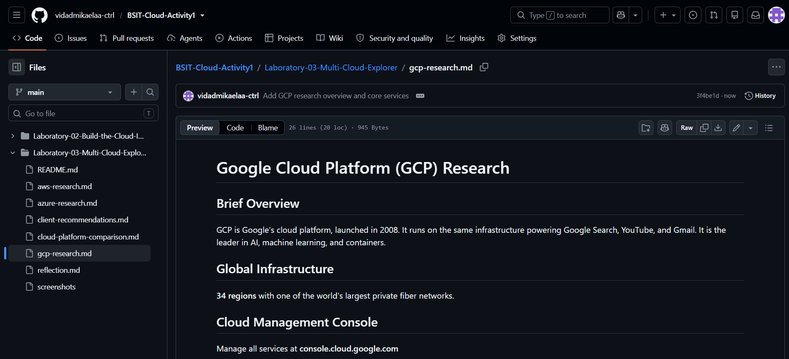

# Google Cloud Platform (GCP) Research

## Brief Overview

Google Cloud Platform (GCP) is Google's cloud computing platform, officially launched in 2008. It provides cloud services for computing, storage, networking, databases, artificial intelligence (AI), machine learning, and data analytics. GCP is recognized for its innovation in AI, big data, and Kubernetes technologies.

---

## Global Infrastructure

Google Cloud Platform operates a worldwide network of cloud infrastructure that includes:

- Regions
- Zones
- Edge Locations

This infrastructure provides reliable, scalable, and high-performance cloud services to customers around the world.

---

## Cloud Management Console

The Google Cloud Console is a web-based interface used to create, manage, and monitor GCP resources.

Official Website:
https://console.cloud.google.com/

---

## Four (4) Core Services

### 1. Compute Engine

Provides virtual machines that run applications in Google's infrastructure.

### 2. Cloud Storage

Offers secure, scalable object storage for files and backups.

### 3. Cloud SQL

Provides managed relational databases including MySQL, PostgreSQL, and SQL Server.

### 4. Google Kubernetes Engine (GKE)

A managed Kubernetes service for deploying, managing, and scaling containerized applications.

---

## Three (3) Advantages

- Excellent AI and Machine Learning services.
- Strong Kubernetes and container support.
- High-performance global network.

---

## Typical Enterprise Use Cases

- Artificial Intelligence and Machine Learning
- Big Data Analytics
- Containerized Applications
- Web and Mobile Application Hosting
- Cloud-native Development

---

## Screenshot

Insert a screenshot of the Google Cloud homepage or Google Cloud Console.

Example:

---

## References

- https://cloud.google.com/
- https://cloud.google.com/docs
